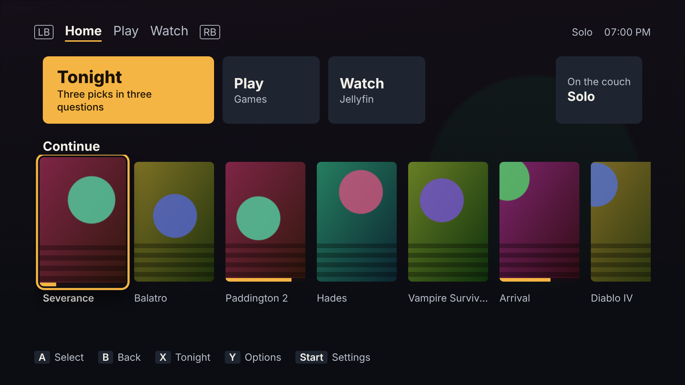

# Couch Launcher

A controller-first home screen for the living-room TV that answers one question: **what should we play or watch tonight?**

Installed Steam games (including non-Steam shortcuts such as Battle.net titles) and the Jellyfin library sit side by side. Either starts with one button press. The **Tonight** picker asks three quick questions and suggests three things, each with a reason.

- Runs as a full-screen web app on the gaming PC, started from Steam's Gaming Mode (SteamOS / Bazzite) or Big Picture (Windows) like any other game.
- One small local service and one config file. No accounts, no telemetry, and no internet needed beyond artwork and Steam store genres.
- Read-only towards Steam: it never writes Steam's files.
- Playback is handed to Jellyfin Desktop.



## Install

Each platform has a folder in `out/` (build it with `bun run build`, see Development) containing the single executable, its installer and the support files.

### SteamOS / Bazzite (Linux)

Everything installs under your home directory; nothing needs root.

```sh
cd out/linux
./install.sh --dry-run   # see every step first
./install.sh             # asks for the Jellyfin URL and API key
```

The installer:
1. Copies the executable to `~/.local/bin/couch-launcher`.
2. Creates `~/.config/couch-launcher/config.toml` and sets the Jellyfin URL and API key.
3. Installs and starts the systemd user service.
4. Installs Chromium (Flatpak), gives it controller access, and writes `~/.local/bin/couch-launcher-kiosk`.
5. Installs Jellyfin Desktop (Flatpak). Open it once in Desktop Mode and sign in.
6. Prints the steps to do by hand in Steam:
   - add `couch-launcher-kiosk` as a non-Steam game named "Couch Launcher"
   - add Jellyfin Desktop as a non-Steam game
   - apply the key-mapped controller layout from [`steam-input/README.md`](steam-input/README.md)

### Windows

Per user, no administrator rights:

```powershell
cd out\windows
powershell -ExecutionPolicy Bypass -File .\install.ps1 -DryRun   # see every step first
powershell -ExecutionPolicy Bypass -File .\install.ps1
```

The installer copies the executable to `%LOCALAPPDATA%\couch-launcher` and creates `%APPDATA%\couch-launcher\config.toml`. It starts the service at sign-in through the per-user Run key, and creates a "Couch Launcher" shortcut (Edge, full-screen app window). Add that shortcut and Jellyfin Desktop to Steam as non-Steam games for Big Picture.

### Check it

```sh
couch-launcher doctor
```

`doctor` prints what the service finds and changes nothing: config, Steam root and user, libraries, game counts, Jellyfin reachability, and the playback and kiosk commands. On Windows the report is also saved to `%LOCALAPPDATA%\couch-launcher\doctor.txt`.

Then work through [`docs/ON_DEVICE.md`](docs/ON_DEVICE.md). It is the checklist of what can only be verified on the real machine.

## Using it

| Controller | Action |
| --- | --- |
| D-pad / left stick | Move focus (hold to repeat) |
| A | Select |
| B | Back |
| X | Tonight picker, from anywhere |
| Y | Item options: favourite, hide, session length |
| LB / RB | Switch between Home, Play and Watch |
| Start | Settings |

Keyboard equivalents: arrows, Enter, Escape, `x`, `y`, `q`, `e`, `s`.

- **Home**: the Tonight button, a Continue row (recent games and Jellyfin resume items), and the profile chip.
- **Play**: installed games. Sort by recent, A–Z or playtime; filter by couch co-op and full controller support.
- **Watch**: Continue Watching, Next Up, Recently Added Movies and Recently Added Shows.
- **Tonight**: answer how long, who, and play/watch/either. You get a best match, a "finish what you started", and a wildcard, each with a reason. "Show three more" rerolls; skipped picks drop back for 7 days.
- **Profiles**: Solo, Two of us, Group. Favourites, hidden items and picks are per profile.
- **Settings**: Steam and Jellyfin health, rescan, text size, and hidden items (Unhide).

## Configuration

`config.toml` is created with comments on first run (`couch-launcher config-path` prints where). Secrets live only there.

| Key | Default | Meaning |
| --- | --- | --- |
| `server.port` | `7744` | Local port (the service listens on 127.0.0.1 only) |
| `steam.root`, `steam.user_id` | auto | Steam folder and 32-bit account id |
| `jellyfin.url`, `jellyfin.api_key`, `jellyfin.user_id` | — | Server, API key, user (blank = first user) |
| `playback.handoff` | `client` | `client` (Jellyfin Desktop, remote-controlled) or `web` (web client in the kiosk browser) |
| `playback.client_shortcut` | `Jellyfin` | Name of the Jellyfin Desktop non-Steam shortcut |
| `playback.client_command` | platform default | Command used when no such shortcut exists |
| `ui.scale` | `1.0` | Interface scale; Settings can override it |
| `kiosk.restart_after_game`, `kiosk.restart_command` | `false` | Linux input-loss mitigation (see ON_DEVICE.md) |
| `picker.weights.*` | see file | Tonight scoring weights |
| `picker.genre_session_map` | see file | Steam genre → short / medium / long session |

## Development

Requires [Bun](https://bun.sh) 1.4+. The UI tests use Node 22 and Playwright's Chromium.

```sh
bun install
bun run check          # lint, typecheck, unit + API tests, web build, Playwright: the gate for every change
bun run dev            # service in mock mode on http://127.0.0.1:7744 (needs `bun run build:web` once)
bun run build          # out/linux and out/windows: single executables plus installers
bun scripts/wine-smoke.ts   # optional: run the Windows .exe under Wine
```

`COUCH_MOCK=1` runs everything from `fixtures/`: a synthetic Steam install, a fake Jellyfin server, and recorded (never executed) launches. `COUCH_NOW` pins the clock.

- `docs/BRIEF.md`: the specification
- `docs/DESIGN.md`: how it is built, with test evidence per phase
- `docs/DECISIONS.md`: every decision where the brief was silent or wrong
- `CLAUDE.md`: conventions and commands
